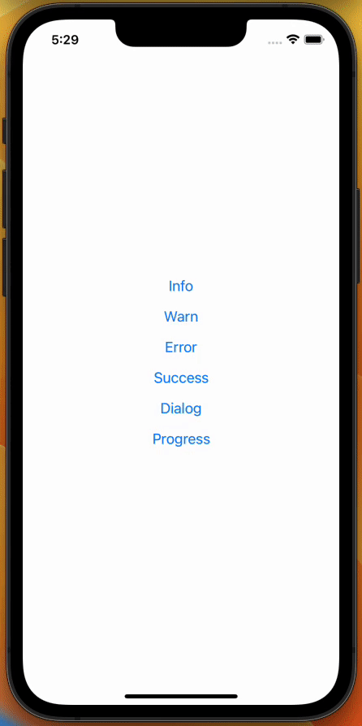
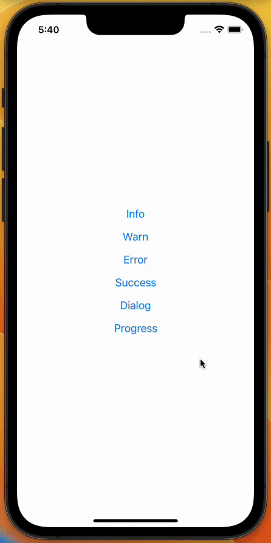

# react-native-global-flow

react-native-global-flow is a powerful React Native library that allows developers to effortlessly 
show important information to users within their apps. With a range of versatile features, including a customizable banner, 
a global progress modal, and a convenient dialog manager, this library simplifies the process of delivering essential messages to your user without
the need of managing painful states.

## Key Features:

- Global Banner: Display eye-catching banners at the top of the app to instantly grab user attention. Customize the content and appearance of the banners to suit your app's branding and requirements.
- Global Progress: Easily manage global progress indicators that inform users about ongoing background tasks or operations. Show progress, loading spinners to provide real-time feedback on the status of actions.
- Dialog Manager: Effortlessly push dialogs using a simple React hook.

# Installation & Setup

```bash
yarn add react-native-global-flow

# The library rely on react-native-reanimated & react-native-safe-area-context, you need to install these packages in your project
yarn add react-native-reanimated react-native-safe-area-context
```

Setup react-native-reanimated:
```js
// Add this to your babel.config.js :
plugins: ['react-native-reanimated/plugin']
```

Setup the provider:
```ts
import { SafeAreaProvider } from 'react-native-safe-area-context';
import { GlobalFlowProvider } from 'react-native-global-flow';

const App = () => {
  // Note: SafeAreaProvider is required to make the library working
  return (
    <SafeAreaProvider>
      <GlobalFlowProvider>
          {/* Your app */}
      </GlobalFlowProvider>
    </SafeAreaProvider>
  );
};
```

# Usage

## Global Banner



```ts
import { useGlobalBanner } from 'react-native-global-flow';

// 1. Call the hook
const showBanner = useGlobalBanner();

// 2. Show banner (you should use the method inside a callback or effect
showBanner('success', 'This is a success message')
showBanner('info', 'This is an info message')
showBanner('warn', 'This is a warning message')
showBanner('error', 'This is an error message with custom duration of 2.5 seconds', 2500)
```

## Global Progress



```ts
import { useGlobalProgress } from 'react-native-global-flow';

// 1. Call the hook
const { showGlobalProgress, hideGlobalProgress } = useGlobalProgress();

// 2. Show the progress
showGlobalProgress();

setTimeout(() => {
    // 3. Hide the progress
    hideGlobalProgress();
}, 5000);
```

## Dialog Manager

The dialog manager is a more complex features than others, you can check the [documentation here](./docs/dialog-manager.md) 

## Customization

The `GlobalFlowProvider` take few params in order to configure the library.

 - `bannerConfig`: configure colors & styles for each type of messages
 - `progressConfig`: configure the component that is shown with the global progress
 - `defaultDialogConfig`: define default options value when pushing a dialog
